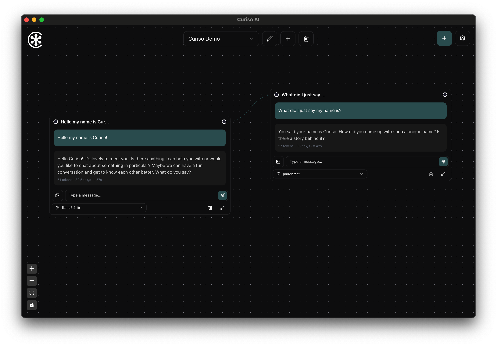

# Curiso.ai

   


Curiso AI is an infinite canvas for your thoughts—a platform that seamlessly connects nodes and AI services to explore ideas in depth without repeating yourself. By guiding the direction of each conversation, Curiso.ai empowers advanced users to unlock richer, more accurate AI interactions. Created by Carsen Klock.

## Features

- **Multi OS**: Windows, macOS, and Linux app
- **Infinite Canvas**: Create and organize your thoughts visually on an unlimited workspace
- **Multiple Default AI Provider Integration**:
  - W.ai
  - Inference.net
  - Deepseek
  - OpenAI
  - Anthropic
  - Google
  - xAI
  - Groq
  - OpenRouter
  - Alibaba Cloud

- **Local AI Inference Provider Integration**:
  - Ollama
  - Exo
  - Jan.ai
  - LM Studio
  - vLLM

- **Custom Model Support**: Add and configure custom AI models
- **Model Metrics**: View metrics for models like tok/sec and total tokens
- **RAG Support (Retrieval Augmented Generation)**: Add and configure RAG documents and websites locally
- **Local Transformers.js Embedding Models or OpenAI**: Add and configure local embedding models or OpenAI embedding models
- **Local VectorDB IndexedDB**: Local VectorDB IndexedDB for RAG
- **Inference Parameters**: Customize the inference parameters for your conversations
- **Multiple Boards**: Create and manage multiple workspaces
- **Vision Model Support**: Add images to your chats for vision models
- **Customizable Interface**:
  - Theme color selection
  - Grid snapping
  - Pan and zoom controls
  - Double-click zoom functionality
- **Node-Based Conversations**: Connect ideas and conversations through an intuitive node chat system
- **Secure**: Local encrypted storage of API keys and sensitive data




## Getting Started

### Download and Install latest release

Available for Windows, macOS, and Linux.
[Download latest release](https://github.com/metaspartan/curiso/releases/latest)

## Developers

### Prerequisites

- [Bun](https://bun.sh/) runtime installed on your system > v1.2.0
- [Rust](https://www.rust-lang.org/) installed on your system > v1.86.0
- [Tauri CLI](https://tauri.app/start/) installed on your system
- API keys for the AI services you plan to use or Ollama/Exo/Jan.ai/LM Studio/vLLM/etc. installed locally or remotely

### Installation

1. Install Tauri CLI:

```bash
cargo install tauri-cli
```

2. Clone the repository:

```bash
git clone https://github.com/metaspartan/curiso.git
```

3. Navigate to the project directory:

```bash
cd curiso
```

4. Install dependencies:

```bash
bun install
```

5. Run the development build:

```bash
sudo bun run desktop
```

## Known Issues

- On Windows, you will get CORS errors when trying to connect to a local running Ollama instance. Run the command below in command prompt and restart Ollama to resolve this issue.

```bash
set OLLAMA_ORIGINS=*
```

## Solana Token

Curiso ($CUR) is a utility token on the Solana blockchain.

[$CUR on Dexscreener](https://dexscreener.com/solana/8TbsZ3yH1mBHytVpmMn4qED2UeF3FgWUVt1pd5RBpump)

[$CUR on Solana](https://solscan.io/token/8TbsZ3yH1mBHytVpmMn4qED2UeF3FgWUVt1pd5RBpump)

[$CUR on Coingecko](https://www.coingecko.com/en/coins/curiso)

### Tokenomics

- **CA**: 8TbsZ3yH1mBHytVpmMn4qED2UeF3FgWUVt1pd5RBpump
- **CUR Total Supply**: 1,000,000,000 CUR
- **Dev Fund**: ~14,868,655 CUR, 10,000,000 locked until April 2025 with 3 month cliff of ~3,333,333 CUR per month for 3 months.
- **Blockchain**: Solana
- **Name**: Curiso
- **Ticker**: CUR

### Token & Curiso Roadmap
Q1-Q3 2025 Goals:

- CUR will be integrated as the main payment method for tiered premium subscriptions, making it a utility token on Solana.
- By integrating with the Pyth network, we'll ensure stable USD pricing for your subscriptions, bringing you a consistent and reliable experience.
- A portion of CUR used in subscription payments will be burned, supporting the token's long-term value and collectability.
- Introduce a staking pool program where CUR holders can earn rewards, funded by a portion of Curiso subscription purchases, to support token holders.

#### Subscription Payments
What’s Coming: CUR will be integrated as the main payment method for premium subscriptions, making it a utility token on Solana.

#### Stable Sub CUR Pricing with Pyth
What’s Coming: By integrating with the Pyth network, we'll ensure stable USD pricing for your subscriptions, bringing you a consistent and reliable experience.

#### Token Burn Mechanism
What’s Coming: A portion of CUR used in subscription payments will be burned, supporting the token's long-term value and collectability.

#### CUR Lock Staking Pools
Possibility: Introduce a staking pool program where CUR holders can earn rewards, funded by a portion of Curiso subscription purchases, to support token holders.

Stay tuned as we progress through these phases, bringing enhanced value and utility to your CUR experience. Thank you for your support and feedback as we continue to evolve!

## Contributing

Contributions are welcome! Please feel free to submit a pull request. If you have any questions, ideas, or suggestions, please feel free to open an issue.

## License

This project is licensed under the MIT License - see the [LICENSE](LICENSE) file for details.

## Author

Carsen Klock - [@metaspartan](https://github.com/metaspartan) [@carsenklock](https://x.com/carsenklock)

## Socials

- [X](https://x.com/curisoai)
- [Telegram](https://t.me/curiso_official)
- [Discord](https://discord.gg/xvS9ymZuH4)

## Acknowledgments

- [Tanstack Query](https://tanstack.com/)
- [Tauri](https://tauri.app/)
- [Vite](https://vitejs.dev/)
- [Bun](https://bun.sh/)
- [Rust](https://www.rust-lang.org/)
- [Ollama](https://ollama.ai/)
- [OpenAI](https://openai.com/)
- [Anthropic](https://www.anthropic.com/)
- [Google](https://www.google.com/)
- [xAI](https://x.com/)
- [Groq](https://www.groq.com/)
- [OpenRouter](https://openrouter.ai/)
- [Jan.ai](https://jan.ai/)
- [LM Studio](https://lmstudio.ai/)
- [Exo](https://github.com/exo-explore/exo)
- [Alibaba Cloud](https://www.alibabacloud.com/)
- [DeepSeek](https://www.deepseek.com/)
- [W.ai](https://www.w.ai/)
- [Inference.net](https://inference.net/)
