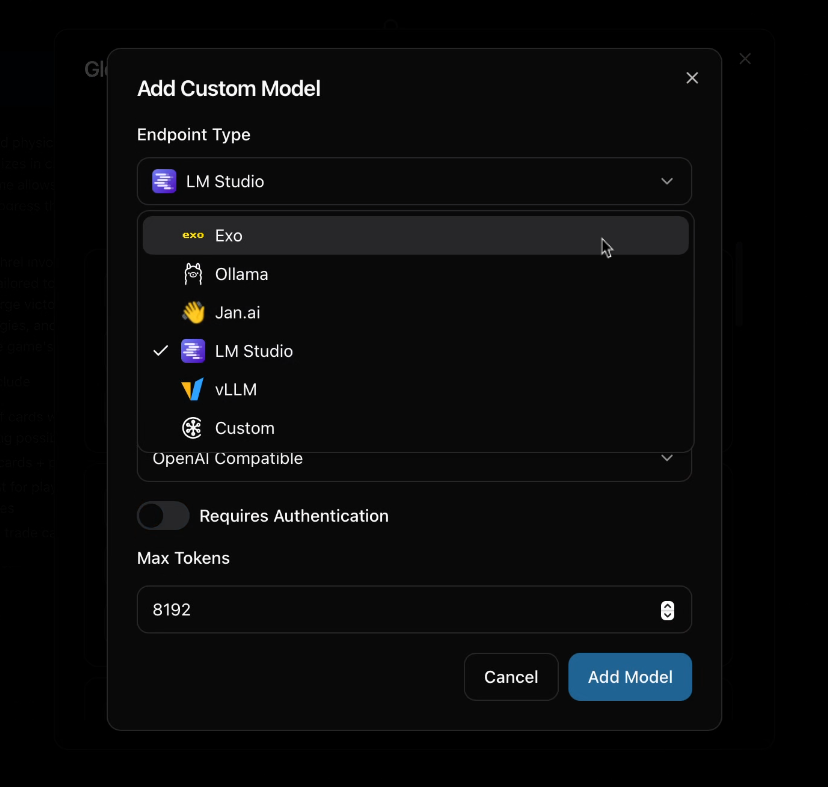

# Curiso.ai

Curiso AI is an infinite canvas for your thoughts—a platform that seamlessly connects nodes and AI services to explore ideas in depth without repeating yourself. By guiding the direction of each conversation, Curiso.ai empowers advanced users to unlock richer, more accurate AI interactions. Created by Carsen Klock.

## Features

- **Infinite Canvas**: Create and organize your thoughts visually on an unlimited workspace
- **Multiple AI Provider Integration**:
  - OpenAI
  - Anthropic
  - Google
  - xAI
  - Groq
  - OpenRouter

- **Local AI Inference Provider Integration**:
  - Ollama
  - Exo
  - Jan.ai
  - LM Studio

- **Custom Model Support**: Add and configure custom AI models
- **Inference Parameters**: Customize the inference parameters for your conversations
- **Multiple Boards**: Create and manage multiple workspaces
- **Vision Model Support**: Add images to your chats for vision models
- **Customizable Interface**:
  - Theme color selection
  - Grid snapping
  - Pan and zoom controls
  - Double-click zoom functionality
- **Node-Based Conversations**: Connect ideas and conversations through an intuitive node chat system
- **Secure**: Local encrypted storage of API keys and sensitive chat data




## Donate

If you find Curiso.ai useful, please consider donating to support its development.

Bitcoin (BTC) Address: bc1qgamupnnd2v0uj8a5cffyn8d25atahwq3wexue8

Solana (SOL) Address: FLXQhZgyNGgNzE7MEniiHkrh3bs8kfHjd4J1L7KgBWso

## Getting Started

### Download and Install latest release

Available for Windows, macOS, and Linux.
[Download latest release](https://github.com/metaspartan/curiso/releases/latest)

## Developers

### Prerequisites

- [Bun](https://bun.sh/) runtime installed on your system
- API keys for the AI services you plan to use or Ollama installed locally

### Installation

1. Clone the repository:

```bash
git clone https://github.com/metaspartan/curiso.git
```

2. Navigate to the project directory:

```bash
cd curiso
```

3. Install dependencies:

```bash
bun install
```

4. Run the development build:

```bash
bun run desktop
```

## Known Issues

- On Windows, you will get CORS errors when trying to connect to a local running Ollama instance. Run the command below in command prompt and restart Ollama to resolve this issue.

```bash
set OLLAMA_ORIGINS=*
```

## Contributing

Contributions are welcome! Please feel free to submit a pull request. If you have any questions, ideas, or suggestions, please feel free to open an issue.

## License

This project is licensed under the MIT License - see the [LICENSE](LICENSE) file for details.

## Author

Carsen Klock - [@metaspartan](https://github.com/metaspartan) [@carsenklock](https://x.com/carsenklock)

## Acknowledgments

- [Tanstack Query](https://tanstack.com/)
- [Tauri](https://tauri.app/)
- [Vite](https://vitejs.dev/)
- [Bun](https://bun.sh/)
- [Rust](https://www.rust-lang.org/)
- [Ollama](https://ollama.ai/)
- [OpenAI](https://openai.com/)
- [Anthropic](https://www.anthropic.com/)
- [Google](https://www.google.com/)
- [xAI](https://x.com/)
- [Groq](https://www.groq.com/)
- [OpenRouter](https://openrouter.ai/)
- [Jan.ai](https://jan.ai/)
- [LM Studio](https://lmstudio.ai/)
- [Exo](https://github.com/exo-explore/exo)
